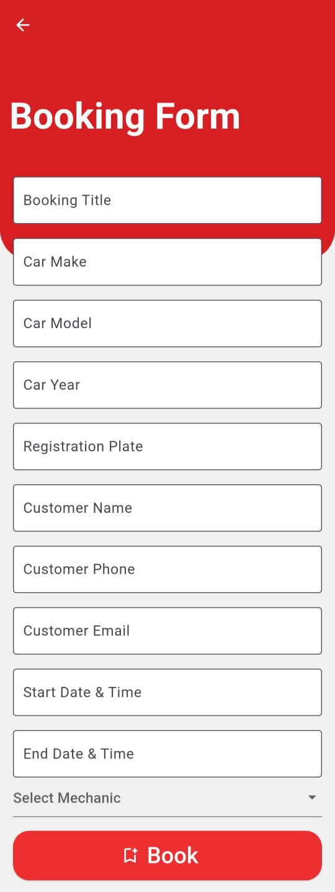

# ServiceBay

This mobile application was developed as part of a task assignment for **Ichinban Auto Limited**. The app is designed to streamline car workshop management by allowing admins and mechanics to manage bookings, view calendars, and handle appointments efficiently.

## Features

1. **User Authentication:**
    - **Sign In/Sign Up**: Secure authentication system with Firebase, enabling users (admin and mechanic) to sign in or sign up based on their role.

2. **Role-based Access:**
    - **Admin Home**: Admin users can view all bookings, manage appointments, and view a calendar of scheduled bookings.
    - **Mechanic Home**: Mechanics can access their individual calendar and appointments assigned to them.

3. **Booking Creation:**
    - **Booking Form**: Allows users to create and manage service bookings, including details about the car and customer requirements.

4. **Calendar View:**
    - **Admin Calendar**: Displays a comprehensive view of all bookings for the admin.
    - **Mechanic Calendar**: Shows the mechanic's individual bookings and scheduled appointments.

5. **Appointment Management:**
    - **Appointment List & Details**: Admins and mechanics can view a list of appointments and delve into appointment details to track the status or any special requirements.

## Screenshots

<table>
  <tr>
    <td style="text-align:center">
      
      <p style="text-align:center">Splash Screen</p>
    </td>
    <td style="text-align:center">
      
      <p style="text-align:center">Sign In</p>
    </td>
    <td style="text-align:center">
      
      <p style="text-align:center">Sign Up</p>
    </td>
    <td style="text-align:center">
      
      <p style="text-align:center">Admin Home</p>
    </td>
  </tr>
  <tr>
    <td style="text-align:center">
      
      <p style="text-align:center">Mechanic Home</p>
    </td>
    <td style="text-align:center">
      
      <p style="text-align:center">Booking Form</p>
    </td>
    <td style="text-align:center">
      
      <p style="text-align:center">Admin Calendar View</p>
    </td>
    <td style="text-align:center">
      
      <p style="text-align:center">Mechanic Calendar View</p>
    </td>
  </tr>
  <tr>
    <td style="text-align:center">
      
      <p style="text-align:center">Appointment List</p>
    </td>
    <td style="text-align:center">
      
      <p style="text-align:center">Appointment Details</p>
    </td>
  </tr>
</table>


## Installation Instructions

### Prerequisites
- Flutter SDK (Version 3.0 or later)
- Firebase project setup (for authentication and Firestore)
- Android Studio or VSCode for development and testing

### Steps to Install
1. **Clone the Repository:**
   ```bash
   git clone https://github.com/Imran-Chowdhury/ServiceBay
2. **Navigate to the Project Directory:**
   ```bash
   cd ServiceBay
3. **Install Dependencies: Ensure you have all the required Flutter dependencies installed**
   ```bash
   flutter pub get

### Set Up Firebase:

1. **Create a Firebase project** and configure it with your app:
   - Go to the [Firebase Console](https://console.firebase.google.com/).
   - Click on "Add Project" and follow the instructions to create a new Firebase project.

2. **Add `google-services.json` to the app**:
   - In the Firebase Console, select your project.
   - Navigate to "Project Settings" and click on "Android" or "ios" to add respective apps.
   - Then follow the instructions given by firebase.

3. **Enable Firebase Authentication**:
   - In the Firebase Console, go to "Authentication" from the left sidebar.
   - Click on "Sign-in method" and enable the required authentication methods (e.g., Email/Password).

4. **Enable Firestore**:
   - In the Firebase Console, go to "Firestore Database" from the left sidebar.
   - Click "Create Database" and follow the instructions to set up Firestore in production or test mode.
